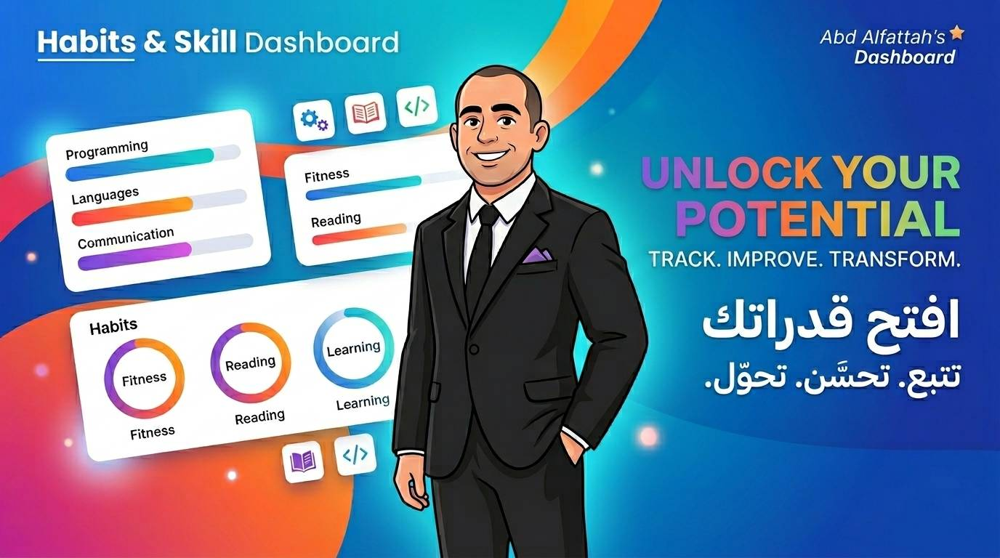

# Habits & Skill Dashboard 🚀

A personal, highly responsive web-based development dashboard built with pure semantic **HTML5** and **CSS3**. This project is designed as a fully independent, offline-capable tool to track coding progress and consistency in building daily atomic habits.

---

## 📸 Project Identity & Branding

The project follows a modern, professional visual identity tailored for an active web developer. 



> **"TRACK. IMPROVE. TRANSFORM."**

---

## 🛠️ Features Implemented

* **Semantic Structure:** Full utilization of HTML5 structural elements (`<header>`, `<nav>`, `<main>`, `<footer>`) for clean, SEO-friendly code.
* **Skill Tracker Box:** Dynamically measured skill bars for web development languages (**HTML: 70%**, **CSS: 5%**, **JS: 0%**).
* **The 50-Day Consistency Grid:** A custom-built block grid displaying 50 consecutive trackable days with integrated interactive checkboxes.
* **Custom Box Model Engineering:** Built with strict layout properties (`width`, `height`, `padding`, `margin`) manually adjusted to perfectly adapt to mobile and tablet screen viewports.

---

## 📁 Project Directory Structure

```text
Habits-Skill-Dashboard/
│
├── index.html          # Main clean semantic HTML structure
├── README.md           # Documentation and presentation file (This file)
│
├── css/
│   └── style.css       # Custom box-model layout and typography styling
│
└── img/
    └── header.jpg      # Official visual identity and banner image